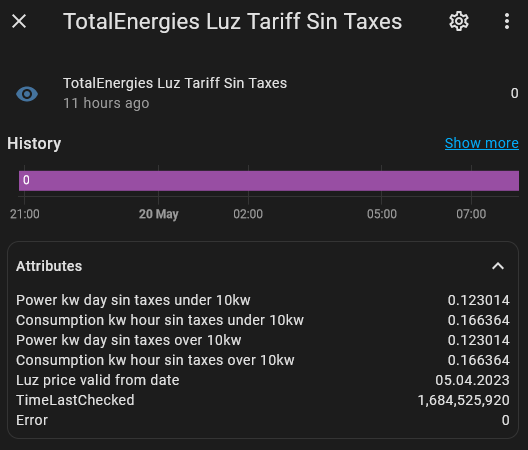

# totalenergies-unofficial-api-home-assistant

TotalEnergies (Espana) Unofficial API - for the 'A tu Aire luz Siempre' Plan

Can be used for 'Home Assistant' and tracking the cost to your electricity.

# Install PHP
totalenergies-unofficial-api.php

1) Place the PHP script somewhere it can be reached via home assistant and follow the home assistant steps below to expose the JSON results as sensors (if thats the intended purpose). Otherwise can be used as a JSON API for other projects.

Example JSON output

    {"power_kw_day_sin_taxes_under_10kw":"0.123014","consumption_kw_hour_sin_taxes_under_10kw":"0.166364","power_kw_day_sin_taxes_over_10kw":"0.123014","consumption_kw_hour_sin_taxes_over_10kw":"0.166364","power_kw_day_con_taxes_under_10kw":"0.129810","consumption_kw_hour_con_taxes_under_10kw":"0.175556","power_kw_day_con_taxes_over_10kw":"0.149591","consumption_kw_hour_con_taxes_over_10kw":"0.202307","luz_price_valid_from_date":"05.04.2023","timeLastChecked":1684566971,"error":0}

# Install YAML
configuration.yaml

1) Copy all the code in the yaml file and place into your own configuration.yaml file in home assistant.
2) Replace [PASTE HTTPS LINK TO PHP FILE 'totalenergies-unofficial-api.php'] with the actual URL to the totalenergies-unofficial-api.php script.
3) Restart Home Assistant.

# Screnshots

